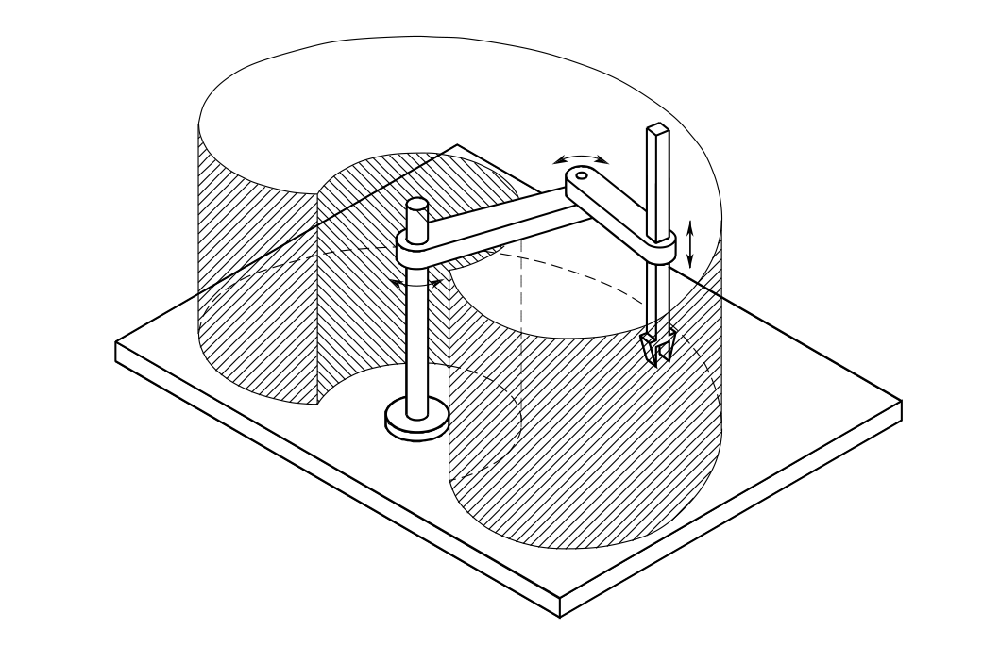

# scara
Modelling and control of the SCARA-robot, a state-of-the art pick-place application
### What will be done:
1. Modelling in URDF
2. Implementation of controller with Gazebo and ROS.


### How to:
To launch the project:

```
roslaunch scara_robot scara.launch
```

To move the robot to any point in (reachable) space, for example [0.4, 0.4, 0.4], type:
```
rostopic pub /des_pos geometry_msgs/Point "x: 0.4
y: 0.4
z: 0.4" 
``` 
