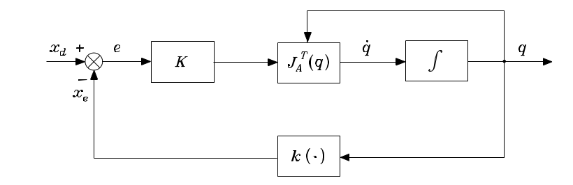
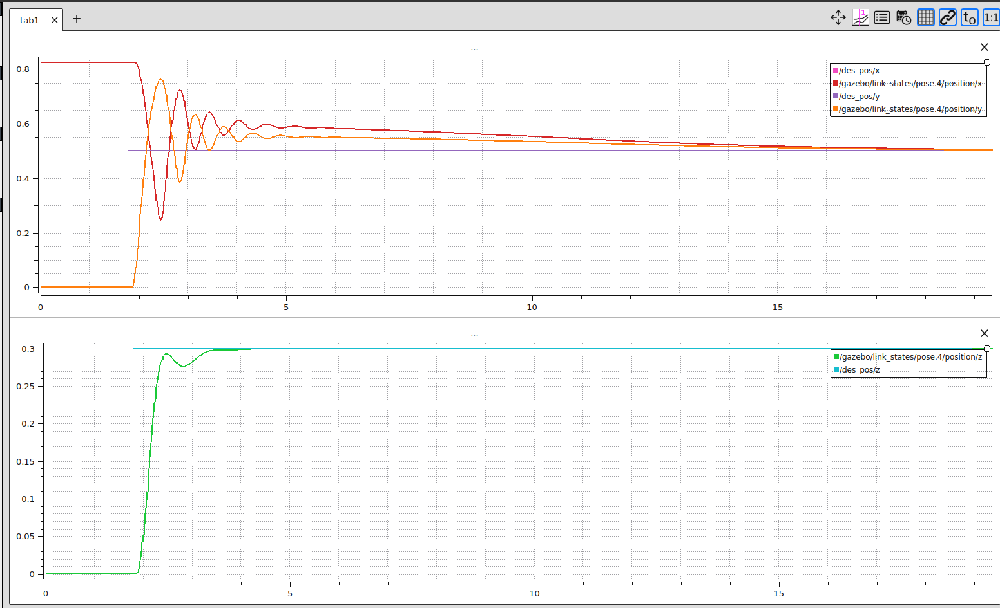

# scara
Modelling and control of the SCARA-robot, a state-of-the art pick-place application
### What will be done:
1. Modelling in URDF
2. Implementation of controller with Gazebo and ROS.


### How to:
To launch the project:

```
roslaunch scara_robot scara.launch
```

To move the robot to any point in (reachable) space, for example [0.4, 0.4, 0.4], type:
```
rostopic pub /des_pos geometry_msgs/Point "x: 0.4
y: 0.4
z: 0.4" 
``` 

### Open Loop inverse kinematics:
An Open Loop inverse kinematic has been implemented, computing the joint angles of the SCARA arm in order to reach a published desired position.
By following a trajectory of 5 points, the algorithm has been validated by the following plot:


The error(blue) tends fast to zero, until a new desired positio is published. The tracked positions show good control behavoiur with only oscillation before reaching steady state.

### Closed Loop inverse kinematics:

The CLIK algorithm shown in the schematic has been implemented using the following Jacobian Matrix of the robot:

```math
J_a(q) = \begin{bmatrix} 
        -l_1 * s_1 - l_2 * s_{12} & -l_2 * s_{12}  & 0 \\
        l_1 * c_1 + l_2 * c_{12} & l_2 * c_{12} & 0 \\
        0 & 0 & 1
       \end{bmatrix}
```

For integration in discrete time, the following approximation has been used:

$$
\dot{q} \approx \frac{q_{k+1} - q_{k}}{T_s} \qquad q_{k+1} = q_k + T_s \ \dot{q}
$$

Matrix calculations are made with Eigen3, a library for linear algebra.



As seen in the Plot, control behaviour using the CLIK is stable and reaches the desired value, but conversion in x and y direction is slow and shows too many oscillations in the beginning. Improvement can be achieved by tuning PID parameters of the internal controllers as well as the $K matrix used for the CLIK-Algorithm.

Being indepenent of the joint angles for the arm segments, control behaviour in z-direction is faster and acceptable.